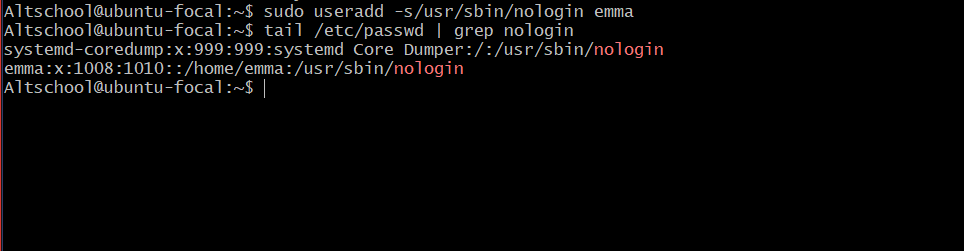

# Altschool Cloud Live Class Assignment 1

## Tasks

Your username: altschool (home directory /home/altschool). The home directory includes these sub-directories: code, tests, personal, misc. Unless otherwise specified, all commands are executed from the home directory.

#### a. Change directory to the tests directory using absolute pathname

#### b. Change directory to the tests directory using relative pathname

#### c. Use the echo command to generate a file named "fileA" with the text content 'Hello A' in the misc directory.

#### d. Create an empty file named "fileB" in the misc directory, then add dummy content.

#### e. Copy the contents of fileA into fileC.

#### f. Move the contents of fileB into fileD.

#### g. Create a tar archive called misc.tar for the contents of misc directory.

#### h. Compress the tar archive to create "misc.tar.gz".

#### i. Create a new user and enforce password change upon login.

New user creation with password:

Command to mandate password change:

New user attempts to log in:

#### j. Lock a user's password.

#### k. Create a user without a login shell.

#### l. Disable password-based authentication for SSH.

#### m. Disable root login for SSH.

